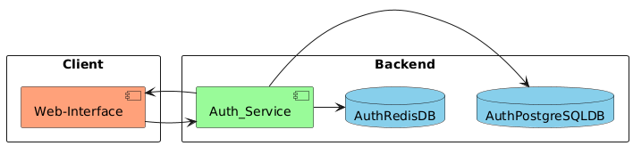
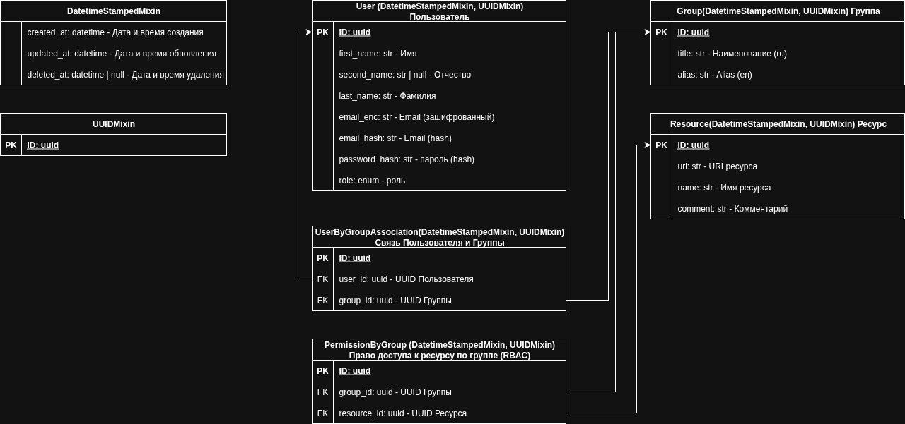
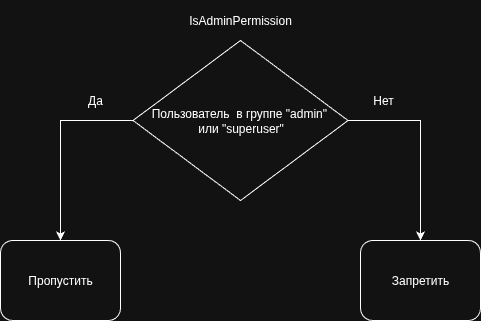
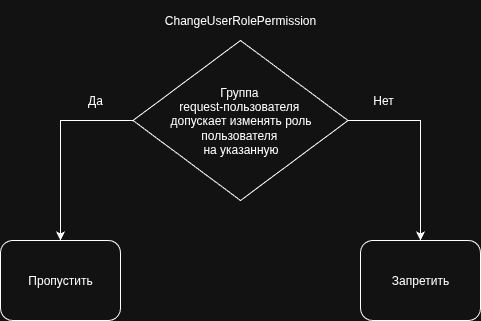
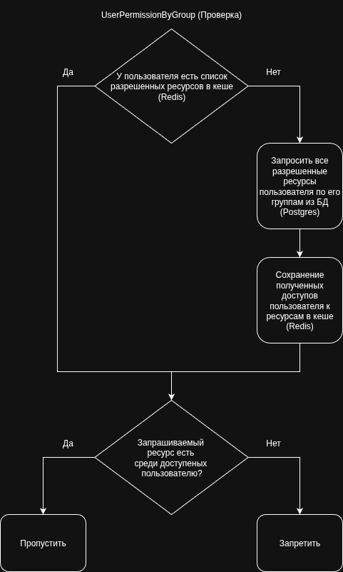
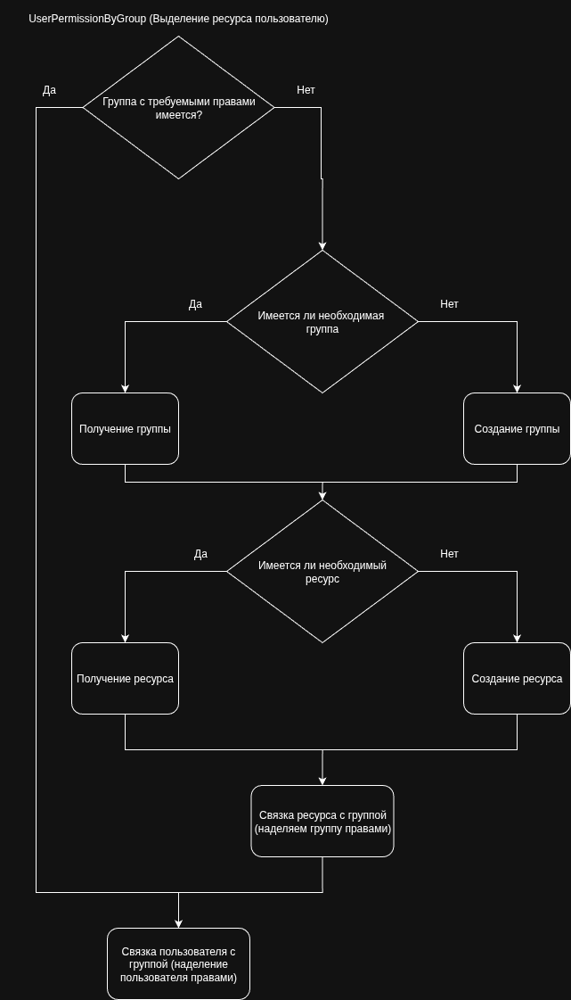

# Auth Project (Test Task)

* * *

**Задача (Бизнес Задача):**
1. Необходимо реализовать backend-приложение – собственную систему аутентификации и авторизации;
2. Необходимо продумать систему доступа к ресурсам;
3. Приложение не должно быть полностью основано на соответствующих возможностях фреймворков, идущих «из коробки»;

* * *


## Оглавление:
- [Требования](#требования)
- [Архитектура сервиса](#архитектура-сервиса)
- [Архитектура данных в PostgreSQL](#архитектура-данных-в-postgreSQL)
- [Описание работы системы разграничения прав доступа](#описание-работы-системы-разграничения-прав-доступа)
- [Запуск проекта (локально)](#запуск-проекта-локально)
- [Запуск проекта (docker-compose)](#запуск-проекта-docker-compose)
- [Документация проекта](#документация-проекта)
- [Тестовые данные пользователей](#тестовые-данные-пользователей-для-авторизации)
- [Дальнейшие доработки](#дальнейшие-доработки)
- [Работа с Pre-commit](#работа-с-pre-commit)
- [Соглашения разработки](#соглашения-разработки)
- [Code Style](#code-style)


## Требования:
### Функциональные:
1. Регистрация Пользователя: ввод имени (фамилии, отчества), email, пароля, повтор пароля;
2. Обновление информации Пользователя: Пользователь может редактировать свой профиль;
3. Удаление Пользователя: мягкое удаление с последующим ре-авторизацией;
4. Авторизация Пользователя: по email и паролю;
5. Ре-авторизация Пользователя;
6. Реализация системы разграничения прав доступа Пользователя с использованием соответствующих status-code;
7. Позволить Пользователю-Администратору изменять права доступа другим Пользователям;

### Нефункциональные:
- **Availability**(доступность системы):
- - SLA(Service Level Agreement): 99%;
- - Время обработки запроса: ~200-300мс.;
- **Reliability**(надежность системы): >= 85%;
- **Fault Tolerance**(отказоустойчивость системы):
- - Механизмы быстрого восстановления после сбоев;


## Архитектура сервиса:



## Архитектура данных в PostgreSQL:



## Используемые решения в проекте:
- Django Rest-Framework(v.3.16.1): https://www.django-rest-framework.org/;
- Django(v.5.2.5): https://docs.djangoproject.com/en/5.2/;
- Redis(v.7.2-bookworm) - redis v.6.2.0: https://redis.io/;
- Postgres(v.17.5) - psycopg2-binary v.2.9.10: https://www.postgresql.org/;
- Uvicorn(v. 0.35.0): https://www.uvicorn.org/;
- Система авторизации JWT (python-jose v.3.5.0): https://datatracker.ietf.org/doc/html/rfc7519;
- Шифрование данных: симметричный алгоритм шифрования **AES-GSM**;
- Хеширование данных: 
- - cryptography: https://cryptography.io/en/latest/;
- - HMAC: https://docs.python.org/3/library/hmac.html;


## Описание работы системы разграничения прав доступа:
### Система разграничения прав делится на 2 составляющие:
#### Ограничение по роли пользователя:
1. **IsAdminPermission**:
- проверка, что роль пользователя (полученной из его AccessToken) **admin** или **superuser**;
- чтобы пользователь имел более высокие права, требуется изменить его роль;

2. **ChangeUserRolePermission**:
- проверка допустимости менять роль при обновлении сущности пользователя(пользователь более низкого уровня роли не 
может изменить свою роль на более высокую);
- чтобы пользователь имел более высокие права, требуется изменить его роль;
- преимущества: более простой вариант, требует меньше контроля;

#### Ограничение по правам групп, в которых состоит пользователь:
1. **UserPermissionByGroup**: 
- проверка доступа пользователя к ресурсу по наличию доступов по всем группам, в которых 
состоит пользователь;
- чтобы пользователь получил доступ к ресурсу(например, к созданию новой группы), требуется связать пользователя с 
группой, которая имеет доступ к данному ресурсу (или создать данную группу, создать ресурс, выделить ей доступ к 
ресурсу и связать пользователя с группой);
- преимущества: более гибкий вариант, требуется следить в каких группах находится пользователь и какие права есть у 
этих групп;
#### Важное замечание(!): Resource.name должен быть равен имени uri (urls.urlpatterns.path.name)

Обычно две системы работают вместе, т.е. при проверке используется **OR** (например, 
**IsAdminPermission | UserPermissionByGroup**).

### Схемы-описаний Permission-ов:
#### IsAdminPermission:


#### ChangeUserRolePermission:


#### UserPermissionByGroup:
1. Проверка:



2. Логика (шаги) для выделения ресурса пользователю:




## Запуск проекта (локально):
1. Создайте файл **.env** и скопируйте в него конфигурации из файла **.env_example**. Добавьте те конфигурации, 
которые имеют **[Local]** (это необходимый минимум, остальные по необходимости). Обратите внимание на конфигурации при 
поднятии доп. сервисов и запуске проекта (например, **POSTGRES_HOST** и **REDIS_HOST**). 

2. При необходимости, поднимите связанные сервисы в **docker-compose-local.yaml** (PostgreSQL, Redis):
```sh
docker compose -f ./docker-compose-local.yaml up -d
```

3. Установите зависимости:
```sh
pip install -r requirements.txt
```

4. Запустите проект:
```sh
uvicorn service_auth.service_auth.asgi:application --host 0.0.0.0 --port 8000 --reload
```


## Запуск проекта (docker-compose):
1. Создайте файл **.env** и скопируйте в него конфигурации из файла **.env_example**. Добавьте те конфигурации, 
которые имеют **[Docker_Compose]** (это необходимый минимум, остальные по необходимости).

2. Поднимите сервисы:
```sh
docker compose -f ./docker-compose.yaml up -d
```

3. Или, если требуется поднять сервисы с открытыми портами **PostgreSQL, Redis**:
```sh
docker compose -f ./docker-compose.yaml -f docker-compose.override.yaml up -d
```


## Документация проекта:
- Swagger (после запуска проекта): **http://127.0.0.1:8000/api/swagger/**


## Тестовые данные пользователей (для авторизации):
| User (first name) | Role  | Email                  | Password           |
|-------------------|-------|------------------------|--------------------|
| **first_name_1**  | user  | **user_1@example.com** | **passworD_123!**  |
| **first_name_2**  | admin | **user_2@example.com** | **passworD_1234!** |
После поднятия проекта User(**first_name_1**) будет иметь доступ к ресурсу по созданию группы: 
**uri=auth/groups/create**, **name=create_group**


## Дальнейшие доработки:
Примерный план по дальнейшей работе над проектом (какие работы над проектом я бы проводил в дальнейшем):
- Написание unit-тестов для сервиса + нагрузочное тестирование.
- Разграничение api_auth на два приложения: приложение авторизации и приложение по контролю прав доступа;
- Добавление Web-сервера для балансировки, проксирования и отдачи статики (например, Nginx);
- Добавление API по:
- - Получению списка сущностей с пагинацией, фильтрацией и сортировкой.
- - Обновлению прав пользователя к ресурсам в Redis (дабы пользователь не ждал, пока в Redis обновится его кеш с 
правами по "exp", а мог по отправке запроса в API обновить свой кеш с правами).
- Добавление двухфакторной аутентификации через email(обязательно, при создании пользователя или смене email) и Oauth;
- Правка скрипта по генерации тестовых данных.
- К временным меткам о создании, обновлении и удалении добавить кто это сделал (created_by, updated_by, deleted_by).
- Расширение документации для **view**.
- Добавление CI.


## Работа с Pre-commit:
1. Установка pre-commit (если не установлен):
```sh
pip install pre-commit==4.3.0
```
2. Обновление хуков до последней версии (при необходимости):
```sh
pre-commit autoupdate
```
3. Применение хук на всех файлах (например, **black**):
```sh
pre-commit run black --all-files
```
4. Очистка кэша pre-commit
```sh
pre-commit clean
```

5. Обхватить новые конфиги pre-commit
```sh
pre-commit install --overwrite
```


## Соглашения разработки:
### GitFlow:
#### Ветки (branches):
- **main**: основная(работоспособная) ветка кода, содержащая код для отправки на ревью;
- **develop**: рабочая ветка, содержащая актуальную кодовую базу для разработки;

#### Работа с ветками:
- Разработка нового функционала: branch: develop -> feature/....;
- Исправление ошибки в новом функционале: branch: develop(main) -> fix/...;

### RESTful URI:
#### Версионирование:
- Поддержка **Stripe**-подхода (https://docs.stripe.com/api/versioning);

#### Шаблоны построения URI-методов:
- Ссылка на источник: https://www.vinaysahni.com/best-practices-for-a-pragmatic-restful-api#restful


## Code Style:
- **PEP8**(https://peps.python.org/pep-0008/);
- Docstring-формат - **reStructuredText (reST)**;
- Linters: **Flake8**(https://flake8.pycqa.org/en/latest/);
- Pre-commits(https://pre-commit.com/):
- - **black** - авто-форматирование кода;
- - **flake8** - проверка стиля и ошибок;
- - **mypy** - статическая типизация;
- - **isort** - сортировка импортов;
